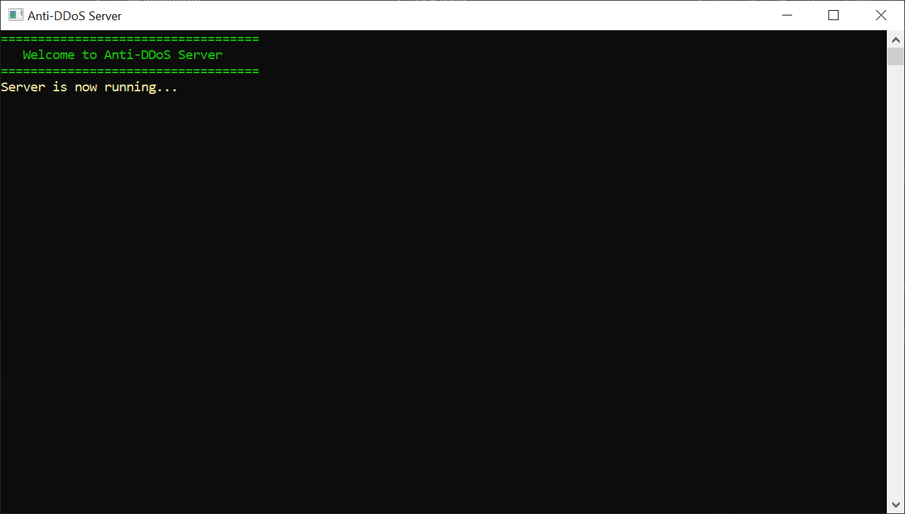
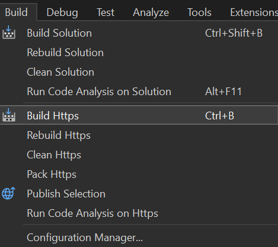

# Anti-DDoS Server



This is a simple Anti-DDoS application written in VB.NET. The application is designed to provide protection against DDoS attacks by blocking suspicious IP addresses.

## Setup Instructions

Here are the steps to prepare and run the Anti-DDoS Server application:

### 1. Clone Repository

Clone this repository into your system using the following Git command:

```bash
git clone https://github.com/VernSG/growtopia-http.git
```

### 2. Build HTTPS



### 3. Run Executable
After setting up HTTPS and preparing the server, you can run the executable (exe) from the release. Follow these steps:

Navigate to the project directory.
Open the bin\Release folder.
Run the http.exe file by double-clicking on its icon.
Make sure to pay attention to required permissions and firewall rules to ensure the application runs smoothly.


### Development Recommendation

It is recommended to use Visual Studio 2022 for further development and customization of this application. Visual Studio 2022 provides a powerful integrated development environment (IDE) and comprehensive tools for building .NET applications easily.

---

By following the above steps, you have now successfully prepared and run the Anti-DDoS Server on your system. Happy using!

If you have any questions or issues, feel free to contact us at [email@yusufkartein.com](mailto:email@yusufkartein.com).
